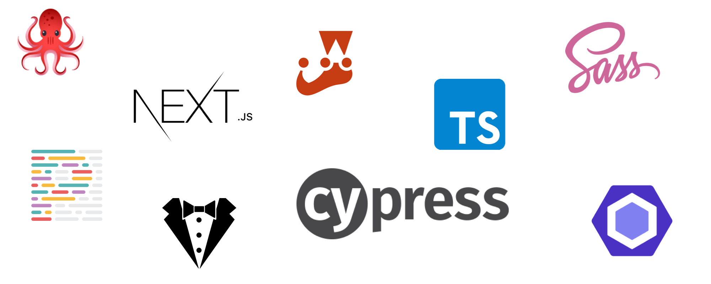

# React.js <-> Next.js Kickstart
As the saying, react is nothing but writing whatever you want in web language, Next Js is like a check applied over the freedom given to React 😉
Feel free to use this Boilerplate as a starting point for your own Next.js Projects.

### Local Development
Use command,

```
npm run dev
```

### Execute Project Build
Create a production build using,

```
npm run build
```

### Run the App
Run the app on a server using,

```
npm run start
```

- (This needs an already generated build file)
- (This is not a live reload)

### Lint your Code
You can run one of the following commands to lint your code.

```
npm run lint // JS & CSS
npm run lint:scss
npm run lint:js
```

### Test
Code checks and test can be done using the following commands,
Unit test the code and create snapshots for the respective components.

```
npm run test:unit
npm run test:unit:update // Update Snapshots
```

Run one of these commands to run your integration & e2e tests.

```
npm run cypress // Command Line
npm run cypress:open // GUI
```

### Typescript - A check of your types
To verify your static typing run the following command.

```
npm run type:check
```

## Technologies Used


